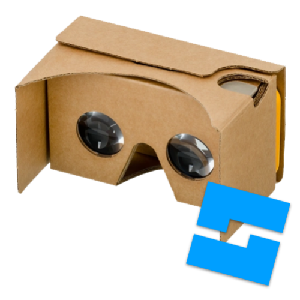

# Cardboard
Cardboard is a collection of game development utilies for the Roblox platform designed to make debugging and writing code easier. It is fast and modular with a minimal amount of fatal errors that can occur.

Cardboard is not yet in a usable state. It is not meant to be used in a project yet. Eventually, it may be at that point, but it is not there so far.

## History
Cardboard was created in 2022 to help me debug a fighting game that modifies the original Roblox map "Crossroads". It was originally called RDM (Raycast Debug Module). It is still in use on that project and is constantly being updated with that project.

The open-source Cardboard is a work-in-progress replacement to it that will also debug multiple different kinds of errors that are not just raycasting problems.

## Installation
- Roblox store page: [After 3.1 release]
- Source code: [bendaws/cardboard/releases](https://github.com/bendaws/cardboard/releases)

Source code translation tests happen every commit. You should be able to drag and drop source code files with minimal changes. You can also run the [``utils/translate-rblx.py``](utils/translate-rblx.py) file to automatically switch references to the corresponding object in ``game.ReplicatedStorage.Cardboard``.

If you plan to use Cardboard with the recommended directory layout, here is where your objects go:
- game
    - ServerScriptService
        - [Cardboard](src/cardboard.luau) (cardboard.luau)
    - ReplicatedStorage (service)
        - Cardboard (folder)
            - [Console](src/console.luau) (console.luau)
            - [Debug](src/debug.luau) (debug.luau)
            - [Workspace](src/workspace.luau) (workspace.luau)

## License
Cardboard has adapted it's own license, Ben's Open-Source License V3. I wrote this license myself and it is simular to the MIT License.